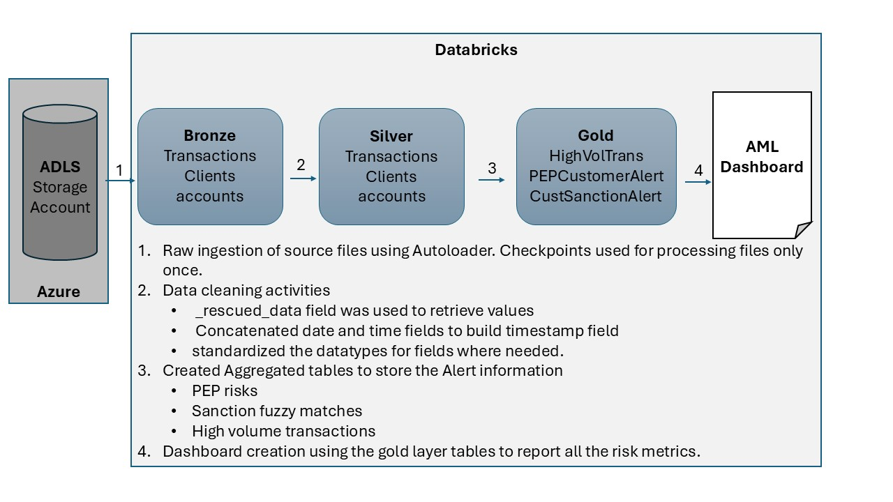
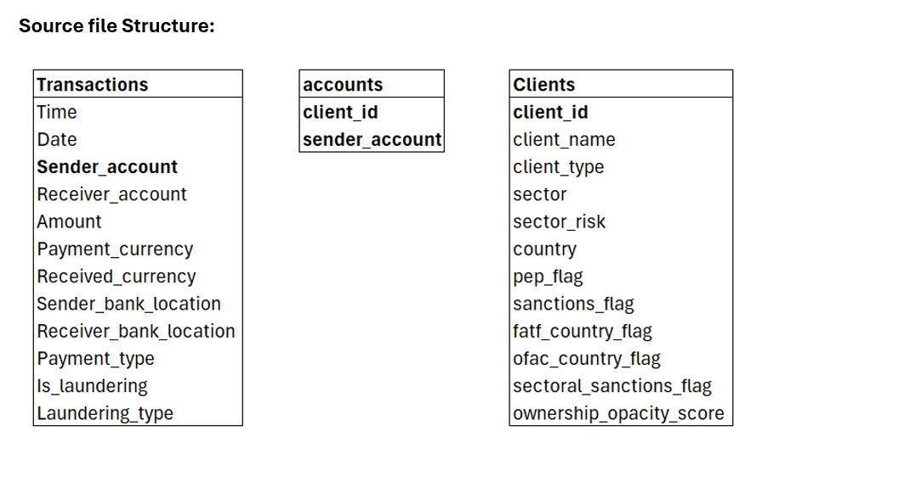
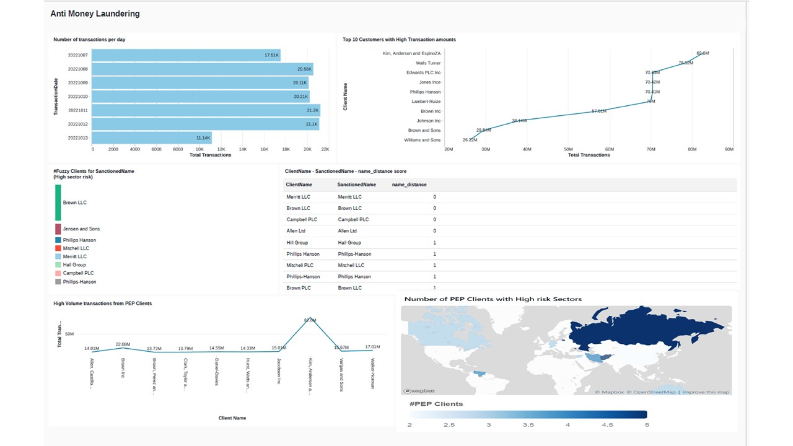
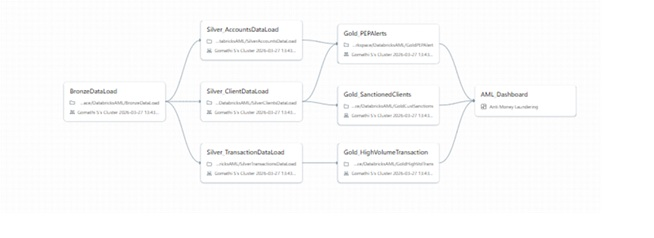

# Design Document: AML Data Pipeline (Medallion Architecture)
## 1. Problem Statement
The goal of this project is to detect high-risk financial activity (PEPs, Sanctioned names, and High-Volume transactions) from raw banking data while ensuring 100% data integrity for compliance.

## 2. Architecture Overview
Implemented a **Medallion Architecture** on Databricks to provide clear data lineage.
<details>

</details>

### Layer Definitions:
* **Bronze:** Raw ingestion from ADLS Gen2 using **Auto Loader**. Stores data in Delta format with schema inference.
<details>

</details>details>

* **Silver:** Data cleansing and validation. Implemented `_rescued_data` recovery to handle malformed CSV and standardized datatypes for fields. 
  
* **Gold:** Business Logic layer. Created aggregated tables and views to identify the PEP risks, high volume transaction risks and Sanctioned client names fuzzy matches. 

## 3. Technical Decisions & Trade-offs
### Why PySpark for Gold?
While SQL is common for Gold, I chose **PySpark** to handle complex logic like `levenshtein` distance for fuzzy name matching, which is more performant in a distributed environment for large datasets.

### Data Recovery Strategy
To prevent "Silent Data Loss," I utilized the `_rescued_data` column. 
```python

# Example of my recovery logic:
df.withColumn("amount", coalesce(col("amount"), get_json_object(col("_rescued_data"), "$.amount")))

```
### Dashboard:
Using the gold layer tables, the dashboard is generated with the below metrics. 
•	Number of transactions per day

•	Top 10 customers with high transaction amounts

•	Client name, Sanctioned name and their distance calculated

•	Number of Fuzzy clients for Sanctioned clients

•	High volume of transactions from PEP clients

•	Number of PEP clients within High risk sectors


<details>

</details>

Job:
End to end orchestration is maintained in job using relevant dependencies. 
<details>

</details>


